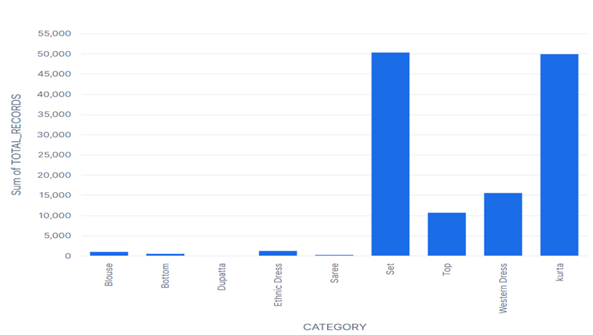

#  E-Commerce Analytics for Sales & Returns Optimization

##  Project Overview
This project demonstrates the design and implementation of a **Snowflake-based data warehouse** for analyzing e-commerce sales and return data. It transforms raw transactional data into a structured dimensional model, enabling efficient querying and business intelligence.

 **Full Report:** [EcommerceAnalysis.pdf](./EcommerceAnalysis.pdf)

---

##  Objectives
- Design a scalable **data warehouse (Snowflake)**
- Implement **dimensional modeling (star schema)**
- Enable efficient **analytical SQL queries**
- Analyze:
  - Sales trends  
  - Product performance  
  - Geographic distribution  
  - Return patterns  
- Support business decisions for:
  - Revenue optimization  
  - Return reduction  
  - Operational efficiency  

---

##  Data Warehouse Architecture

###  Star Schema Design

The system uses a **star schema** with:
- **Fact Tables:** `fact_sales`, `fact_returns`
- **Dimension Tables:** Product, Time, Geography, Channel, Promotion, B2B

✔ Enables fast querying  
✔ Simplifies analysis  
✔ Supports multi-dimensional insights  

---

##  Key Insights & Visual Analysis

---

##  1. Sales Performance & Growth Trends

**Insight:**  
Sales are highly volatile and depend on spikes rather than steady growth.

**Takeaway:**  
Growth is event-driven → need consistent demand strategies.

---

##  2. Revenue by Product Category

**Insight:**  
A few categories dominate revenue (Set, Kurta, Western Dress).

**Takeaway:**  
Heavy dependency on core categories → optimize weaker ones.

---

##  3. Category Contribution (Pareto Effect)

**Insight:**  
Revenue follows a **Pareto distribution (80/20 rule)**.

**Takeaway:**  
Small number of categories drive most revenue.

---

##  4. Geographic Distribution of Sales

**Insight:**  
Sales are concentrated in major urban areas.

**Takeaway:**  
Opportunity to expand into underperforming regions.

---

##  5. State-Level Sales Distribution

**Insight:**  
Some states contribute significantly more orders.

**Takeaway:**  
Regional demand varies → targeted strategies needed.

---

##  6. Returns Distribution & Risk Analysis

**Insight:**  
Returns are concentrated in specific cities.

**Takeaway:**  
Indicates localized operational or product issues.

---

##  7. Monthly Sales Trends

**Insight:**  
- Rapid growth (March → April)  
- Peak in April/May  
- Decline in June  

**Takeaway:**  
Sales are not consistent → need retention strategies.

---

##  8. Category Distribution (EDA)

**Insight:**  
Dataset is skewed toward certain categories.

**Takeaway:**  
Reflects real business concentration.

---

## Power BI Dashboard

Interactive dashboard combining:
- Sales trends  
- Category performance  
- Geographic insights  
- Return risk  

---

##  Technologies Used
- Snowflake  
- SQL  
- Power BI  
- Kaggle Dataset  

---

---

##  Key Takeaways
- Data warehouse enables **scalable analytics**
- Star schema simplifies complex queries
- Revenue concentration → business dependency
- Returns highlight operational inefficiencies
- Insights support strategic decision-making

---

##  Limitations
- No customer-level data  
- Static dataset  

---

##  Future Work
- Add customer segmentation  
- Build real-time pipelines  
- Apply machine learning models  
- Improve dashboard interactivity  

---

This project demonstrates how data warehousing transforms raw transactional data into actionable insights for modern e-commerce decision-making.